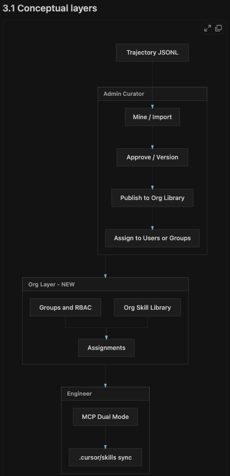
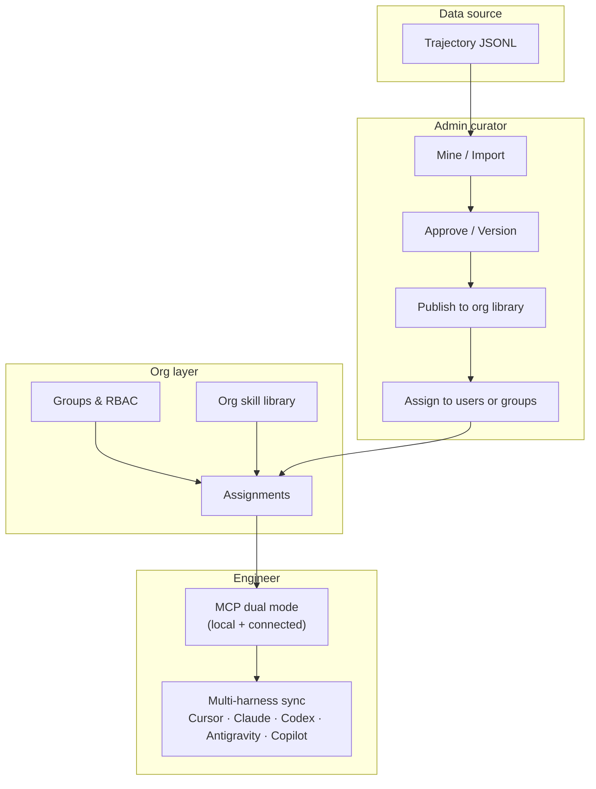

# RunCanon

> A portable, self-updating skill management system that observes how teams actually work with AI agents, discovers reusable workflows, and generates maintainable skill artifacts for Claude, Cursor, GitHub Copilot, and other harnesses.

## Why RunCanon?

AI agents are only as good as the instructions we give them. Today those instructions are scattered across `CLAUDE.md`, `.cursorrules`, Copilot instructions, and internal wikis. They go stale, conflict, and never learn from what actually worked.

RunCanon turns real agent interactions into a **living skill library**:

1. **Collects** interaction trajectories from MCP servers and agent sessions.
2. **Segments** them into ordered skill episodes.
3. **Clusters** episodes by intent + tool/prompt sequence to discover reusable workflows.
4. **Generates** portable skill artifacts for Claude Code, Cursor, Copilot, Continue.dev, Windsurf, and more.
5. **Scores** skills for importance, staleness, and weakness.
6. **Proposes** create / update / merge / retire actions, with a dashboard for review and an autonomy toggle.

## Quick start

### With pnpm

```bash
pnpm install
pnpm run build

cd ../my-project
npx @runcanon/cli init
npx @runcanon/cli mine --source .runcanon/trajectories --source path/to/skills
npx @runcanon/cli review
```

### Local Docker demo (full platform — Show & Tell default)

**All demo CLI and MCP traffic runs through the container**, not host-installed binaries.

```bash
chmod +x scripts/demo-docker.sh scripts/demo-exec.sh scripts/runcanon-mcp-docker.sh
./scripts/demo-docker.sh
```

This **builds the image**, **restarts `runcanon-demo`**, mounts your project at `/project`, and shares `~/.runcanon` for CLI auth.

| Task | Command |
|------|---------|
| Rebuild after code changes | `./scripts/demo-docker.sh` |
| CLI | `./scripts/demo-exec.sh whoami` |
| Login | `./scripts/demo-exec.sh login --server http://127.0.0.1:3000 --email you@co.com --password '…'` |
| Export skills to project | `./scripts/demo-exec.sh export -h claude --project /project` |
| MCP (Claude Code) | `claude mcp add runcanon -s project -- $(pwd)/scripts/runcanon-mcp-docker.sh` |
| MCP tool test | `./scripts/test-mcp-tools.sh` |

1. Open **http://127.0.0.1:3000** and sign in.
2. Follow **Guide** for package and harness setup.
3. As admin, open **Providers** and save LLM API keys (encrypted at rest).
4. Connect CLI via container: `./scripts/demo-exec.sh login --server http://127.0.0.1:3000 --email admin@runcanon.ai --password '…'`

**Show & Tell demo playbook:** [DEMO.md](./DEMO.md) (container-first; project `~/Documents/ai-striker-security-app`).

Or manually (same mounts as `demo-docker.sh`):

```bash
docker build -t runcanon:latest .

docker run -d --name runcanon-demo --rm -p 3000:3000 \
  -v runcanon-data:/data \
  -v "$HOME/Documents/ai-striker-security-app:/project" \
  -v "$HOME/.runcanon:/root/.runcanon" \
  -e RUNCANON_DATA_DIR=/data \
  -e RUNCANON_PROJECT_PATH=/project \
  -e RUNCANON_ADMIN_EMAIL=admin@runcanon.ai \
  -e RUNCANON_ADMIN_PASSWORD=KeyBoard@2021 \
  -e RUNCANON_ENCRYPTION_KEY=0123456789abcdef0123456789abcdef \
  runcanon:latest
```

**First login:** Sign in with the default admin credentials above. You will be prompted to set a new password before accessing the dashboard. Manage users under **Admin > Users**.

### LLM providers

Admins configure Anthropic, OpenAI/Codex, Antigravity, and Ollama in **Admin > Providers**. Secrets are encrypted in the instance data volume (`RUNCANON_DATA_DIR`), not in git or YAML. Use **Test connection** on that page to verify the active provider before running mining.

Engineers run mining locally against their repos, or upload trajectories into their workspace on the instance. When an LLM provider is enabled, mining uses it to generate skill proposals (not heuristics-only).

### Workspaces

Each user gets a **personal workspace** on first login. Skills, proposals, trajectories, and autonomy settings are stored under that workspace on the server.

- **Engineers** see and manage only their own workspace.
- **Admins** can view all workspaces, switch between them, and create additional org workspaces.

Switch the active workspace under **Settings**. LLM provider keys remain org-wide (admin-managed); workspace data stays per user.

### Workspace maintenance

After repeated mines or catalog imports, the dashboard can accumulate duplicate or noisy proposals (for example `existing-skill-*` re-imports). Prune the active workspace on the server:

```bash
curl -X POST -H "Authorization: Bearer $(jq -r .token ~/.runcanon/credentials.json)" \
  http://127.0.0.1:3000/api/maintenance/prune
```

**Admin — all workspaces:**

```bash
curl -X POST -H "Authorization: Bearer $ADMIN_TOKEN" \
  http://127.0.0.1:3000/api/maintenance/prune-all
```

**Background scheduler (Docker):** The dashboard runs org-wide deduplication automatically for every workspace. Configure with:

| Env | Default | Purpose |
|-----|---------|---------|
| `RUNCANON_MAINTENANCE_ENABLED` | `true` | Set `false` to disable |
| `RUNCANON_MAINTENANCE_INITIAL_DELAY_MS` | `120000` | Delay before first run (ms) |
| `RUNCANON_MAINTENANCE_INTERVAL_MS` | `21600000` | Repeat interval (6 hours) |

Requires container CLI login (`./scripts/demo-exec.sh login …`) so `~/.runcanon/credentials.json` exists (mounted into the container). The prune endpoint removes duplicate pending/applied proposals, noisy catalog artifacts, near-duplicate proposed skills (same domain tokens as an active skill), merges duplicate trajectory uploads, and normalizes active skill ids. Safe to run before demos or after cleaning up test data.

### Legacy single-project Docker mount

```bash
docker run -p 3000:3000 \
  -v $(pwd):/project \
  -e RUNCANON_PROJECT_PATH=/project \
  -e RUNCANON_REQUIRE_AUTH=false \
  runcanon:latest
```

```bash
# CLI inside container
docker run -v $(pwd):/project runcanon:latest mine --project /project

# MCP server (stdio)
docker run -i -v $(pwd):/project runcanon:latest mcp
```

## Packages

| Package | Description |
|---|---|
| `@runcanon/spec` | Portable skill schema, validators, and harness transformers. |
| `@runcanon/core` | Episode segmentation, sequence-aware clustering, skill generation, scoring. |
| `@runcanon/cli` | Command-line interface for mining, reviewing, and exporting skills. |
| `@runcanon/telemetry` | Middleware for collecting agent trajectories. |
| `@runcanon/mcp` | MCP server that exposes skill management tools and resources. |
| `@runcanon/harness-claude` | Claude Code `.claude/skills/*.md` and `CLAUDE.md` generators. |
| `@runcanon/harness-cursor` | Cursor `.cursor/rules/*.mdc` and `.cursor/skills/*.md` generators. |
| `@runcanon/harness-copilot` | GitHub Copilot instructions generators. |
| `@runcanon/platform` | Users, sessions, encrypted provider secrets, workspaces. |
| `@runcanon/dashboard` | SvelteKit dashboard for skill library management. |

## Supported harnesses

RunCanon exports to **18+ harness targets** via a pluggable registry:

| Harness | Format |
|---------|--------|
| Claude Code | `.claude/skills/*/SKILL.md` |
| Cursor | `.cursor/skills/*/SKILL.md` + rules |
| GitHub Copilot | `.github/instructions/*.instructions.md` |
| OpenAI Codex | `.codex/skills/*/SKILL.md` + `AGENTS.md` |
| Google Antigravity | `.agents/skills/*/SKILL.md` |
| Browser / Coworker / BrowserOS | `skills/*/SKILL.md` (Agent Skills standard) |
| Windsurf | `.windsurf/rules/*.md` |
| Continue.dev | `.continue/skills/*/SKILL.md` |
| Aider | `.aider/skills/*.md` |
| Gemini CLI | `.gemini/skills/*/SKILL.md` |
| Cline | `.clinerules/*.md` |
| Roo Code | `.roo/rules-code/*.md` |
| Amazon Q | `.amazonq/rules/*.md` |
| JetBrains AI | `.aiassistant/rules/*.md` |
| Zed | `.zed/skills/*/SKILL.md` + `AGENTS.md` |

## Architecture

RunCanon uses a **canonical skill spec** as the single source of truth. Every harness transformer reads this spec and renders it in the target harness's native format. This makes skills portable, version-controllable, and reviewable by humans.

### Conceptual layers (enterprise)





| Layer | Responsibility |
|-------|------------------|
| **Trajectory JSONL** | Real agent sessions recorded via MCP `runcanon_emit_event` or CLI upload |
| **Admin curator** | Mine, approve workspace proposals, publish to org library, assign skills |
| **Org layer** | Groups, RBAC, versioned org skill library, entitlements |
| **Engineer** | Connected MCP reads dashboard + org skills; `runcanon_sync_skills` writes harness-native paths for Cursor, Claude Code, Codex, Antigravity, Copilot, etc. |

### MCP vs CLI vs Dashboard

| Capability | Local MCP/CLI | Connected (`runcanon login`) | Dashboard |
|------------|---------------|------------------------------|-----------|
| Record trajectories | MCP `emit_event`, local JSONL | CLI upload + remote mine | Upload in workspace |
| List / get skills | Local `.runcanon/skills` | `/api/skills`, `/api/org/skills` | Skills + Org library |
| Approve proposals | Local only | **Dashboard only** (prevents split-brain) | Proposals page |
| Publish org skills | — | — | Admin → Org library |
| Assign to groups | — | — | Admin → Assignments |
| Sync to project | Local export | MCP `runcanon_sync_skills` (all harnesses) | Export / entitled export |
| Download one skill | Local read | MCP `runcanon_get_skill` + `writeLocally: true` | — |

### Org administration

Users with **Admin** or **Curator** role can:

1. **Org library** — publish active workspace skills to the organization (`/admin/org-skills`)
2. **Promotion queue** — review engineer/import submissions before publish (`/admin/promotions`)
3. **Groups** — create teams, add members, CSV bulk import (`/admin/groups`)
4. **Assignments** — map org skills to users or groups with mandatory flag, expiry, project scope (`/admin/assignments`)
5. **Metrics** — adoption, sync/export counts, audit trail, signed bundle export (`/admin/metrics`)

Engineers run `runcanon login`, then in any supported harness call MCP **`runcanon_sync_skills`** to pull entitled workspace + org skills into native paths:

| Harness | Skill paths written |
|---------|---------------------|
| **Cursor** | `.cursor/skills/*/SKILL.md`, `.cursor/rules` |
| **Claude Code** | `.claude/skills/*/SKILL.md`, `CLAUDE.md` |
| **Codex / OpenAI** | `.codex/skills/*/SKILL.md`, `AGENTS.md` |
| **Antigravity** | `.agents/skills/*/SKILL.md` |
| **Copilot** | `.github/instructions/*.instructions.md` |

Optional `harnesses: ["cursor","claude"]` on sync limits targets; default is all five primary harnesses.

### Import, create, and edit skills (Admin / Curator)

The **Org library** page (`/admin/org-skills`) supports:

- **Create skill** — author canonical SKILL.md in the browser; saved to workspace and org library
- **Edit skill** — patch org skill markdown (versioned on save)
- **Import from Git** — GitHub or Bitbucket (public or private with token). Tokens are sent once per import and are **not stored**. Imported skills are assessed and optionally **LLM-enriched** using the same pipeline as mining proposals.

```bash
# CLI import (requires runcanon login; curator+ on server)
runcanon import --repo https://github.com/org/skills-repo --branch main --destination org

# MCP (connected mode)
# runcanon_import_skills_from_git { repoUrl, branch?, token?, destination?, enrich? }
```

Restart MCP in Cursor after upgrading to load new tools: `runcanon_sync_skills`, `runcanon_list_assignments`, `runcanon_import_skills_from_git`.

Smoke test: `./scripts/test-mcp-cli.sh`

### Goal Alignment (Overview metric)

Goal Alignment on the Overview page compares recent trajectory episodes against **project goals** in workspace config. If `goals` is empty, the gauge stays at **0%** regardless of trajectory count.

Configure goals via CLI or MCP (requires `runcanon login` for workspace storage):

```bash
runcanon goals set \
  "Automate CVE triage and vulnerability prioritization" \
  "Audit dependencies for known security issues"
runcanon goals list
```

Admin: `runcanon goals set "..." --workspace WORKSPACE_ID`

MCP: `runcanon_set_goals` / `runcanon_get_goals` (optional `workspaceId` for admin).

Verify alignment:

```bash
./scripts/test-goal-alignment.sh          # integration (empty goals → 0%, with goals → >0%)
pnpm --filter @runcanon/core test         # unit tests in scoring.test.ts
curl -H "Authorization: Bearer $TOKEN" http://127.0.0.1:3000/api/stats
```

The subtitle mentions “without human correction”; the current heuristic scores keyword overlap between trajectory intents and stated goals (see `computeGoalAlignmentEnhanced` in `@runcanon/core`).

### Mining (Proposals → Run mining)

Mining calls your **enabled LLM provider** (Admin → Providers) to cluster trajectories and generate skill proposals. It is **synchronous** and typically takes **2–5 minutes** — the button shows “Mining…” until the server responds; this is normal, not a freeze.

Requirements:

1. Trajectory JSONL under the workspace `.runcanon/trajectories/` (upload via Trajectories page, MCP `runcanon_emit_event`, or CLI).
2. An **enabled** LLM provider with a valid API key (Admin → Providers → Enable + Save).
3. Wait for completion — check progress in container logs: `docker logs -f runcanon-demo 2>&1 | rg 'POST /api/mine'`

Example log line when finished:

```
[runcanon] POST /api/mine 200 240239ms user=blessed@runcanon.ai
```

If mining fails immediately, logs usually show `400` with a message (no trajectories, provider disabled, etc.). Intermittent `500` on `/api/skills` with `platform.json.tmp` rename errors are a known concurrent-write race under load — retry or restart the container.

```bash
# CLI equivalent (connected mode)
runcanon login --server http://127.0.0.1:3000
# MCP: runcanon_mine
```

API endpoints (authenticated, RBAC-enforced):

- `GET /api/skills/[id]` — workspace skill by id
- `POST /api/export` — entitled workspace + org export to harness paths (`{ harness: "all" | "cursor,claude,..." }`)
- `GET /api/org/skills` — entitled org library (curators see all)
- `POST /api/org/skills` — publish, create, archive; engineers queue promotion instead of direct publish
- `GET /api/org/sync` — workspace + entitled org skills for MCP sync (`?projectPath=` for project-scoped assignments)
- `GET/POST /api/org/promotions` — curator promotion queue (approve / reject)
- `GET /api/org/metrics` — adoption metrics + audit
- `POST /api/org/bundles` — HMAC-signed air-gapped skill bundle
- `GET/POST/DELETE /api/org/groups` — group CRUD and membership
- `POST /api/org/groups/import` — CSV membership import; `GET ?format=scim` SCIM Users stub
- `GET/POST/DELETE /api/org/assignments` — skill assignments with expiry/project scope (`?scope=mine`)

### Enterprise phase checklist

| Phase | Status | Deliverables |
|-------|--------|--------------|
| **0** Spec + harness renderers | Done | `@runcanon/spec` — Cursor, Claude, Codex, Antigravity, Copilot, Continue, Windsurf, … |
| **1** Connected MCP | Done | Dual mode, remote API, sync/export/list assignments/import |
| **2** Org skill library | Done | Versioned store, publish/archive, Git import, create/edit, promotion queue |
| **3** Groups & assignments | Done | RBAC groups, mandatory assignments, expiry, project scope, entitlements |
| **4** Governance & ops | Done | Metrics, audit, CSV/SCIM stub, signed bundles, cert/review SLA fields |


## Status

RunCanon is in early development. APIs and schemas may change.

## License

MIT - see [LICENSE](./LICENSE).
